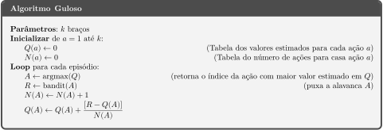

# 🥄 Algoritmo Guloso (Greedy Algorithm)

Veja a implementação do algoritmo no [notebook!](greedy.ipynb)

## Ideia do Algoritmo
A ideia deste algoritmo é utilizar apenas a função *argmax*() para apenas **explotar** os *Q*-valores já estimados pelo agente, com a finalidade de sempre escolher a ação com maior valor estimado.

## Pseudo Código do Algoritmo

## Problema do Algoritmo
Por mais que o Algoritmo Guloso consiga chegar rapidamente a uma recompensa média relativamente grande, ele ficará preso à ela para sempre. Por não praticar **exploração** ele acabará não conhecendo outras ações que podem ser melhores e, na média, ficará preso há uma solução não otimizada.

## Solução
Assim criou-se o **Algoritmo &epsilon;-Guloso** que possui uma chance aleatória de fazer uma ação de **exploração**!
