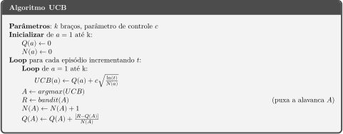

# 📈 Algoritmo de Limite de Confiança Superior (UCB)

Veja a implementação do algoritmo no [notebook!](ucb.ipynb)

## Ideia do Algoritmo
A ideia deste algoritmo é utilizar uma função matemática que avalia ações tomadas com menos frequência de tal maneira que incentive o agente a pegá-las, incentivando a **exploração**.
A função é dada desta maneira:

Onde: 

*Q**t*(*&alpha;*) é o valor estimado da a ação *&alpha;* no tempo *t*.

*c* é o parâmetro que controla a **desconfiança**.

*t* é o número de iterações que ocorreram.

*N**t*(*&alpha;*) é o número de vezes que a ação *&alpha;* foi escolhida até o tempo *t*.

Então aplica-se a função em *Q**t*(*&alpha;*) de *&alpha;* = 1 até *k* e utiliza-se a função *argmax(UCB)*, assim obtendo o índice do maior valor após *UCB* ser aplicado em *Q**t*.

## Entendo a função
A parte da função que está dentro da raiz quadrada é a **desconfiança**. Conforme *N**t*(*&alpha;*) cresce - como ele está no denominador - o valor da **desconfiança** caí. Analogamente, quando *t* cresce, o valor aumenta. Porém, como ele está dentro de um logaritmo, isso significa que seus aumentos serão bem menores com o passar do tempo. O parâmetro *c* ajuda a definir o quão relevante essa desconfiança será.

Isso significa que nas primeiras iterações o valor de **desconfiança** será maior, principalmente para ações menos frequentes, e como essa desconfiança é somada aos *Q* valores estimados por nosso agente, a função *argmax*(*Q**t*) irá priorizar essas ações. Assim, conforme o agente faz mais ações, como *ln*(*t*) crescera bem menos, enquanto *N**t*(*&alpha;*) continuará crescendo normalmente, o valor de **desconfiança** caíra bastante, tornando assim os valores **conhecidos**.

## Pseudo Código do Algoritmo

## Problema do Algoritmo
Esse algoritmo é uma solução excelente para o problema de *k*-Armed Bandit, e é esse o problema; ele é muito bom apenas para esse problema. Se mudarmos o problema para algo com uma **distribuição probabilística não estacionária** (ou seja, que o valor esperado de cada ação muda) esse algoritmo se demonstra ineficaz.
