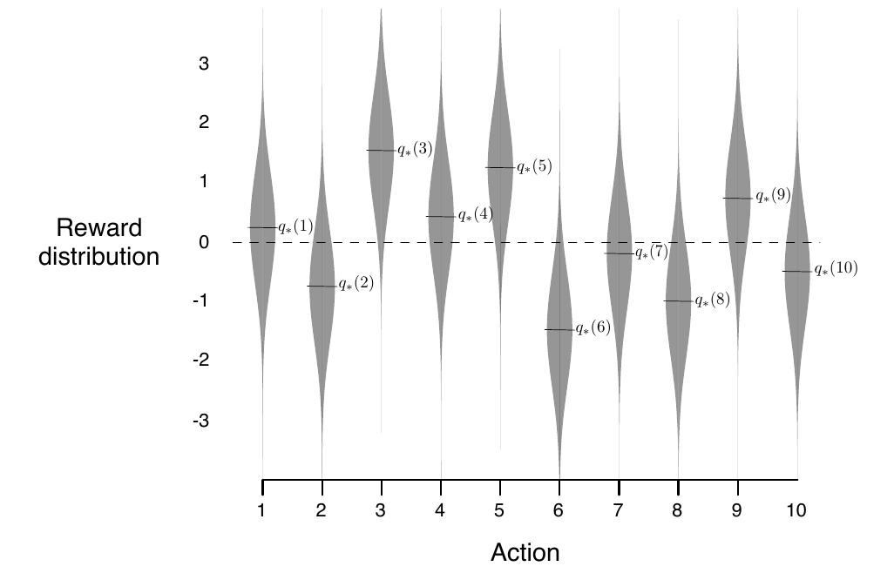

# 🎰 Bandits (Roletas)

  
## Resumo do Problema

Um dos problemas mais clássicos e simples em aprendizado por reforço é o problema do *k*-armed Bandit (em português, Roleta de *k*-alavancas). Nele uma inteligência artificial iria para um cassino e encontraria uma roleta com *k* alavancas, lá ela teria que aprender - por meio de aprendizado por reforço - a escolher a alavanca que lhe da mais dinheiro.

  

## Especificando o Problema

Este problema pode ser generalizado para qualquer situação em que um agente é apresentado a um número *k* de escolhas. Após cada escolha esse agente recebe uma recompensa dentro de uma **distribuição probabilística estacionária** baseado na ação escolhida. A imagem a seguir tenta ilustrar o problema:
  

No nosso problema de *k*-armed Bandit para cada das *k* ações há uma recompensa média **esperada**; esse valor **esperado** geralmente é chamado de o **valor** da ação. Ou seja, definimos o **valor** de uma ação arbitrária *&alpha;*, denotado de *q*\*(*&alpha;*), como uma recompensa em um tempo *t* (*R*t) dado que a ação em *t* (*A**t*) foi *a* como:

 (Esse  significa o valor esperado, é como se fosse a "recompensa média" - a recompensa com maior probabilidade de acontecer dado *&alpha;*.)

Se nosso agente soubesse todos os valores esperados, o problema seria facilmente resolvido: ele simplesmente escolheria a ação com o maior valor, o problema é  justamente que ele não sabe esses valores. E para descobri-los ele necessitará realizar o que chamamos de **exploração e explotação**.

Na **exploração** ele tentará conhecer melhor os valores de cada ação, para que na **explotação** ele já conheça uma variedade de valores diferentes e assim poderá escolher os melhores. Uma analogia com o mundo real seria o menu de um restaurante: imagine que você pediu um prato lá e acabou gostando deste prato, você poderia sempre pedi-lo quando fosse nesse restaurante e acabaria feliz, porém, se não se arriscar a pedir nenhum outro prato nuca saberá se pode haver um prato do qual você acabe gostando mais! 

## Estimando os *Q*-Valores

  

Como nosso agente não conhece os *q*-valores reais cabe a ele tentar estima-los de alguma maneira. Como estamos buscando um **valor esperado** - ou seja, a recompensa média - basta calcularmos a média das recompensas recebidas por nosso agente naquela ação:

Porém, como na computação seria custoso executar uma somatória toda vez que gostaríamos de atualizar *Q* podemos fazer algumas manipulações algébricas e cair na seguinte equação:

Que é a equação que utilizaremos em nosso algoritmos para estimar *Q*! Lembre-se que *n* nesse caso vai ser o *número de vezes que aquela ação ocorreu*. Então teremos um *n* para cada ação.

## Algoritmos Para Este Problema

[Algoritmo Guloso](Agente%20Guloso) - Um algoritmo que só faz **explotação**.

[Algoritmo &epsilon;-Guloso](Agente%20Epsilon-Guloso) - Um algoritmo que mostra como **exploração** é importante.

[Algoritmo com UCB](Limite%20de%20Confiança%20Superior) - Um algoritmo que utiliza um parâmetro de **confiança** para **explorar e explotar**.

[Algoritmo de Softmax]() - :construction_worker: :construction:

[Algoritmo de Eliminação Média]() - :construction_worker: :construction:
