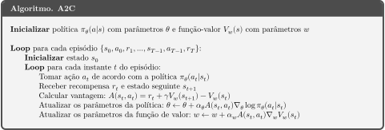

# A2C - Advantage Actor Critic
###### Veja a implementação do algoritmo no [notebook](A2C.ipynb)!

Como vimos na aula de Policy Gradients, existem algoritmos capazes de aprender a política diretamente, utilizando gradiente ascendente neste processo. Porém, modelos como REINFORCE sofrem com grande variância. Para tentar solucionar este problema, surge a ideia de utilizar uma estimativa do retorno. Cada uma dessas estimativas leva a diferentes algoritmos Actor-Critic. Hoje, vamos abordar uma delas, a Advantage (vantagem):

## O Ator e o Crítico

Antes de entrarmos no A2C em si, é interessante explorar o que cada parte do algoritmo faz. Resumindo, o **crítico** atualiza as estimativas da função valor enquanto o **ator** busca atualizar a política na direção sugerida pelo crítico.

Para entender um pouco melhor, de uma forma mais alto nível, [recomendo essa história em quadrinhos](https://hackernoon.com/intuitive-rl-intro-to-advantage-actor-critic-a2c-4ff545978752) (sim, existem historias em quadrinhos de RL)

Enxergando de outra forma, temos que o crítico é a função valor, medindo o quão boas são as ações tomadas, enquanto o ator é a função política, controlando as ações.

* Ator: 
* Crítico: 

## Advantage

Uma das baselines que pode ser desenvolvida é a chamada vantagem, que é definida da seguinte forma:

Em resumo, a vantagem busca medir de forma *relativa* o valor de uma ação comparando com o valor médio das ações naquele estado. Se o valor da vantagem é positivo, levamos o nosso gradiente nesta direção.

Uma das formas de estimar o valor de A(s, a) é usando o nosso velho amigo **bootstrapping**, onde podemos estimar o Q da seguinte forma:

Reescrevendo a vantagem, temos que ela pode ser aproximada a seguir:

É interessante notar que essa forma de aproximar a vantagem usa o mesmo cálculo do Erro de Temporal Difference: . Apesar disso, a vantagem também pode ser aproximada de outras maneiras.

Com essa fórmula, precisamos estimar somente V e não Q. Existem outras formas de estimar a vantagem, como a [Generalized Advantage Estimation](https://arxiv.org/pdf/1506.02438.pdf)

Dessa forma, podemos estimar o gradiente do Advantage Actor-Critic pela seguinte equação:

### A3C vs A2C

O algoritmo inicial foi o A3C (Asynchronous Advantage Actor Critic), por meio de um paper da Deepmind ([Paper de A3C](https://arxiv.org/abs/1602.01783)). Segundo a OpenAI, a parte assíncrona do A3C não traz grande vantagem e é menos eficiente, por isso a ideia do A2C. Não tenho capacidade de entrar no mérito, então vou só pontuar as diferenças.

Ambos os algoritmos atuam em múltiplos ambientes simultâneos, mas enquanto o A3C é atualizado cada vez que um deles termina uma batch de experiências, por isso assíncrono, o A2C espera todos os agentes obterem uma batch para então atualizar com todas simultaneamente, usando a média do update. As diferenças podem ser conferidas [neste link da OpenAI](https://openai.com/blog/baselines-acktr-a2c/).

## Algoritmo do A2C

O pseudocódigo do A2C pode ser visto na imagem a seguir:

É importante ressaltar que essa versão utiliza duas redes neurais, uma para o crítico e outra para o ator, mas implementações com uma só rede são possíveis e serão mostradas no notebook.

## Referências
https://towardsdatascience.com/understanding-actor-critic-methods-931b97b6df3f

https://towardsdatascience.com/introduction-to-actor-critic-7642bdb2b3d2

https://www.freecodecamp.org/news/an-intro-to-advantage-actor-critic-methods-lets-play-sonic-the-hedgehog-86d6240171d/

http://incompleteideas.net/book/first/ebook/node66.html#:~:text=Actor%2Dcritic%20methods%20are%20TD,independent%20of%20the%20value%20function.&text=This%20scalar%20signal%20is%20the,%3A%20The%20actor%2Dcritic%20architecture.

https://openai.com/blog/baselines-acktr-a2c/

https://spinningup.openai.com/en/latest/spinningup/rl_intro3.html#id14
