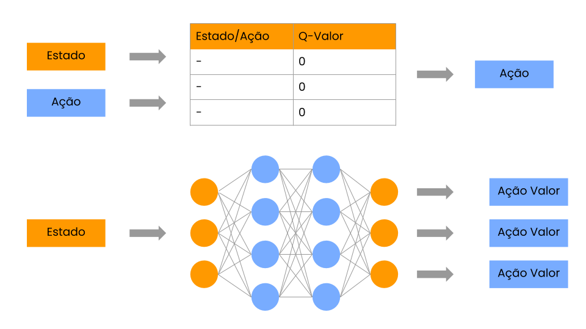
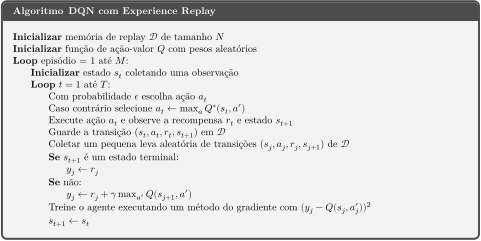

# Deep Q-Network

Aqui faremos a adaptação do algoritmo de Q-Learning com a utilização de redes neurais, assim como feito na implementação da DeepMind: https://deepmind.com/research/publications/human-level-control-through-deep-reinforcement-learning

Aconselhemos a leitura da nossa implementação de Q-Learning caso você não esteja tão acostumado com o algoritmo original e os conceitos básicos, pois isso facilitará seu entendimento de uma **DQN** (abreviação de Deep Q-Network). 

## Motivação

Por que "deep"? Ou, por que aprendizado "profundo"?

Q-Learning por si só já é um algoritmo simples e relativamente eficiente para muitos ambientes, mas o que acontece se nosso ambiente for muito grande? E se precisarmos de uma tabela com milhares de estados e ações? 

Será que nosso agente consegue passar por todas as possibilidades de estados e ações para ter uma boa estimativa do Q-Learning? E mais ainda, será que nosso agente **precisa** passar por todos várias vezes?

O uso de **redes neurais** nesse algoritmo veio para que consigamos aproximar Q-Valores a partir de outros estados e ações e assim não precisamos salvar o valor específico de cada configuração.

## Teoria

Então, basicamente, vamos sintetizar a diferença do Q-Learning para DQN:

### Q-Learning

- Criamos uma tabela-Q
- Para cada configuração de **Estado/Ação** armazenamos a estimativa do nosso agente do **Q-valor**

### DQN

- Criamos uma rede neural com **N-estados** neurônios de entrada e **N-ações** neurônios de saída
- Colocamos camadas escondidas de acordo com nossa implementação
- A rede recebe o estado e tenta predizer o **Q-valor** para cada ação disponível

A função *loss* será o **erro quadrático médio** entre Q-valor estimado pela rede e o valor real, entretando, por se tratar de um problema de aprendizado por reforço, **não temos o valor real!**. Assim, usamos outra estimativa para o valor real, o que chamamos de *bootstrap*. 

Assim temos:
- Predição: 
- Target: 

E nossa função fica, assim como já visto em Q-Learning:

### Experience Replay 

Pelo jeito que as redes neurais "aprendem", não é muito eficiente passar os dados coletados pelo agente enquanto ele explora o ambiente, é mais efetivo que nosso agente colete várias experiências e, após termos muitos dados, ir "alimentando" nossa rede. 

Esse tipo de aprendizado é chamado de **off-policy**, porque ele não acontece ao mesmo tempo em que nosso agente explora o ambiente.

Aqui nós utilizaremos o **Experience Replay**, em que armazemos as experiências do nosso agente na forma , ou seja, o **estado**  em que ele estava, a **ação**  que ele tomou naquele estado, a **recompensa**  que ele recebeu por tomar aquela ação naquele estado e o **próximo estado**  que o agente foi após aquela ação.

Após coletarmos um certo número dessas tuplas , nós passamos aleatoriamente esses dados para a rede aprender.

### Pseudo Código do Algoritmo

