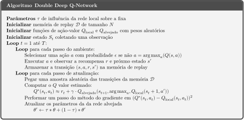

# Double DQN
> Uma extensão do algoritmo de DQN com correção de viés que estabiliza a performance do treinamento do agente.

## Relembrando alguns conceitos

**Algoritmo de Q-Learning:** 

Esse algoritmo, como sabemos, tem como objetivo atualizar as estimativas dos Q valores para os pares estado-ação do ambiente. O valor de Q é atualizado por meio de uma "parcela de correção de erro" (parcela de atualização), com uma taxa de aprendizado α.

A atualização é composta pela recompensa imediata pela última ação tomada ***Rt+1***, o fator de desconto γ multiplicando o maior valor possível esperado de retorno naquele novo estado (após a última ação) menos o valor atual de Q.

**DQN:**

Para problemas em que o método tabular não dá conta, como visto no [notebook de DQN](../Deep%20Q-Network), utilizamos uma rede neural para estimar os valores Q. Porém, ao utilizar somente uma rede neural, os valores de Q tendem a ser superestimados, gerando treinamento menos eficiente e podendo levar a políticas sub-ótimas. Para tentar estabilizar o treinamento, utilizaremos então uma segunda rede neural, chegando no algoritmo DDQN.

## Teoria
Talvez você tenha notado que no algoritmo de Q-learning nós utilizamos uma estimativa do q-valor para fazer uma estimativa do nosso q-valor, as DDQN's surgiram com o objetivo de lidar com este problema.

Nossa equação para o bootstrap é a seguinte:

O Q target vira a soma da recompensa ao tomar a ação *a* no estado *s*, mais o valor máximo de **Q** dentre todas as possíveis ações. Repare que, basicamente o que estamos fazendo é criar uma estimativa nova que depende dela mesma; que depende de uma estimativa anterior que está constantemente mudando:

A função de custo (J) que usaremos para os pesos da rede é dado pela fórmula:

Em que **q(s,a)** é a função valor-ação real do nosso problema, e **Qw(s,a)** é o valor estimado a partir dos pesos da rede neural.

Mas o problema enfrentado é que não temos o **q(s,a)**.

O que fazemos então é aproximar nosso **q(s,a)**, obtendo também um **J(w)** aproximado:

Mas o que pode acontecer a partir disso é que estaremos escolhendo ações que possuem o maior q-valor sem ter tanta certeza de que isso não é um falso positivo, de que não estamos obtendo um q-valor maior para ações não ótimas do que para ações ótimas. O nome desse viés é ***Maximization Bias***, e você pode ler mais sobre ele no incrível [livro de RL dos autores Sutton e Barto](http://incompleteideas.net/book/RLbook2020.pdf).

### Solução:

Quando calcularemos o **Q***bootstrap* nós usaremos duas redes idênticas para separar a escolha de melhor ação do cálculo do q-valor. 

  - Usamos uma rede DQN **Q***local* para selecionar qual é a melhor ação a ser tomada no próximo estado (ação com maior q-valor).

  -  Usamos uma rede DQN **Q***target* para calcular o q-valor de tomar essa ação no próximo estado.

Ou seja:

  - Rede DQN para escolher melhor ação para o próximo estado:  
    

  - Rede **Q***target* calculando o valor **Q**  da escolha acima:
  
    

  E seguimos com nossa expressão do TD Target:
  

Dessa maneira, com um **Q***target* nós conseguimos "fixar" um valor para ser aproximado pelo **Q***local*, simplificando como a rede pode maximizar o q-valor com um viés menor e de maneira mais estável.

Importante notar que faremos apenas o proceso de *backpropagation* na rede local. Para a rede alvejada nós copiaremos os parâmetros de uma para a outra, com um parâmetro *&tau;* definindo quanto uma influênciará a outra.

### Pseudo Código do Algoritmo

