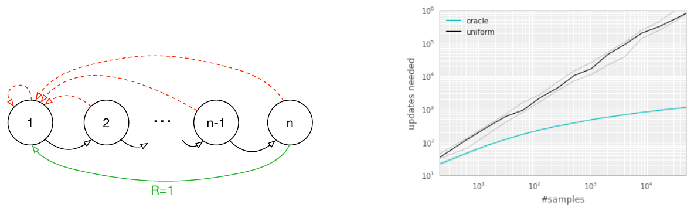
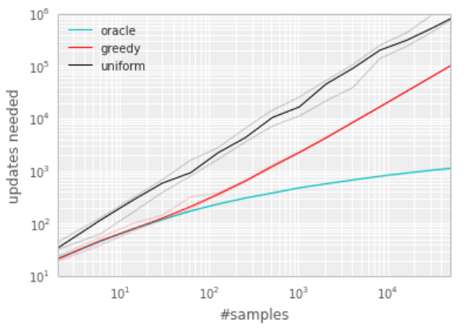
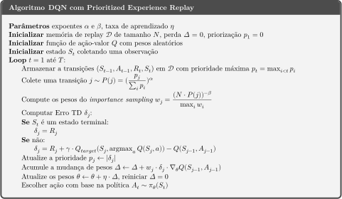

# Prioritized Experience Replay
###### Veja a implementação do algoritmo no [notebook](Prioritized%20Experience%20Replay.ipynb)!

## Experience Replay

Conforme já vimos, a técnica de [experience replay](../Experience%20Replay) é muito importante para garantir a convergência do agente de [DQN](../Deep%20Q-Network). Por um lado, experience replay permite que o agente relembre ao longo do tempo suas experiências antigas, de forma análoga ao epochs utilizados em outras aplicações. Por outro lado, mais matemático, essa prática diminui a correlação entre as observações passadas à rede neural, o que tende a melhorar o treinamento.

Essa noção de que experience replay ajuda o agente a relembrar o passado encontra uma analogia no comportamento animal:

> Numerous neuroscience studies have identified evidence of experience replay in the hippocampus of rodents, suggesting that sequences of **prior experience are replayed**, either during awake resting or sleep. Sequences associated with rewards appear to be replayed more frequently (Atherton et al., 2015; Ólafsdóttir et al., 2015; Foster & Wilson, 2006). **Experiences with high magnitude TD error also appear to be replayed more often** (Singer & Frank, 2009; McNamara et al., 2014).
>
> Prioritized Experience Replay, Schaul et al, 2015. [1] (grifos nossos)

## Prioritized Experience Replay

Conforme destacam os pesquisadores em [1], uma estratégia melhor que simplesmente escolher experiências aleatórias é escolher, de alguma forma, as experiências que mais contribuem para o aprendizado do agente. Inicialmente, consideraremos o ambiente Blind Cliffwalk, abaixo, em que as setas vermelhas são terminais e a seta verde é a única ação com recompensa não-nula. Nesse caso, a transição mais relevante, destacada em verde, provavelmente será vista muito pouco pelo agente.

No gráfico da direita, vemos a comparação entre um agente que escolhe experiências aleatóriamente (_uniform_) e outro que utiliza um oráculo (_oracle_), que sempre sabe qual a ação que acarreta na maior redução do custo. O eixo horizontal indica o tamanho do replay buffer, enquanto o eixo vertical indica o número de updates necessários para treinar o agente. Claramente, o agente com o oráculo aprende mais rápido.

Como não temos um oráculo à disposição, precisamos de alguma métrica que nos indique o quão surpreendente uma dada experiência é. Uma boa alternativa é a função de custo (ou o TD-error, no caso de Q-Learning tabular), visto que ela está associada à diferença entre a estimativa atual do agente de _Q_(_s_,_a_) e a estimativa de bootstrap.

O gráfico abaixo, também de [1], mostra que o uso do erro TD é uma aproximação razoável. A linha preta, que indica o método básico de experience replay, é sempre a de aprendizado mais lento. A linha vermelha (_greedy_) corresponde ao erro TD e é claramente melhor do que o método básico, mas pior do que o oráculo (azul).

## Stochastic Prioritized Experience Replay

A escolha sempre da experiência de maior prioridade (gulosa) é muito sucetível a ruído e incentiva pouco a exploração. Por isso, em geral, amostramos aleatoriamente as experiências, mas dando maior probabilidade para as experiências de maior prioridade:

onde &alpha; determina a quantidade de priorização utilizada. Quando &alpha; = 0, tem-se o caso uniforme.

Em geral, a prioridade é dada por _pi_ = |_Ji_| + &epsilon;, onde &epsilon; é uma constante positiva pequena. O propósito da adição de &epsilon; ao custo é de garantir que todas as experiências tenham alguma probabilidade de serem revisitadas, mesmo se atingirem erro zero.

## Redução do Viés

Em DQN, utilizamos uma função de custo, e.g. o MSE:

A aproximação de bootstrap, de que _J_bootstrap &approx; _J_ideal, é não enviesada quando as experiências utilizadas para calcular _Q_bootstrap têm a mesma distribuição que na esperança. Em outras palavras, quando as ditribuições são as mesmas, espera-se que erros positivos e negativos nessa aproximação se "anulem" com o tempo.

O uso de priorização muda a distribuição das experiências, de forma que essa aproximação se torna enviesada. Uma técnica chamada _importance sampling_ pode ser utilizada para corrigir esse viés, multiplicando a atualização dos pesos por um coeficiente _wi_:

onde &beta;=1 corresponde ao caso não-enviesado (note que as probabilidades ficam uniformes). Analisando as equações, observa-se que as experiências de maior prioridade (que são amostradas mais frequentemente) são dadas menor peso na atualização de &theta;, reduzindo o viés. Essa redução de _wi_ quando o erro é alto também ajuda a mitigar a probabilidade de overshooting.

Em relação ao treinamento do agente, observa-se que a priorização é mais importante no início do treinamento, enquanto a não-enviesamento é mais importante no final do treinamento, quando o agente já está mais estável. Por isso, é comum aumentar o &beta; linearmente de seu valor inicial &beta; = &beta;0 até o valor final &beta; = 1.

### Pseudo Código do Algoritmo

## Referências

[1] [Prioritized Experience Replay, Schaul et al, 2015.](https://deepmind.com/research/publications/prioritized-experience-replay)
