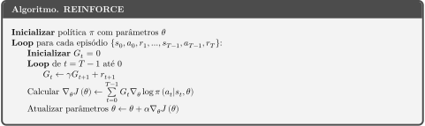
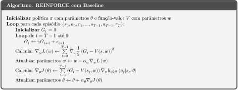

# Policy Gradient (PG)

###### Veja a implementação do algoritmo no [notebook](PG.ipynb)!

## Conceito

Em todos os métodos que vimos até agora (Monte Carlo, TD/Q-Learning, ...), o agente aprende uma função de valor  ou , onde 𝜃 são os parâmetros/pesos do modelo. O agente então segue uma política (𝜀-)gulosa, (quase-)deterministica, derivada da função de valor. Esses métodos são todos aproximações de programação dinâmica e encontram a política ótima de maneira indireta.

Um método alternativo é estimar as políticas ótimas diretamente, ou seja, estimar os parâmetros ótimos 𝜃 para a política .
Os métodos que utilizam gradientes para realizar essa tarefa são chamados de Policy Gradient.

No caso de DQN, nós estimávamos a qualidade de uma ação usando bootstrap e minizávamos o erro entre o agente e esse . Em PG, a situação é um pouco diferente, porque não é tão simples estimar diretamente algum "". Ao invés disso, utilizamos _gradient ascent_ para maximizar alguma função objetivo, como:

-  (valor do estado inicial)
-  (valor médio)
-  (recompensa média)
-  (retorno médio por episódio)

O algoritmo de PG então se reduz a:
,
onde 𝛼 é a taxa de aprendizado. Só falta um detalhe bem importante nessa equação: como calcular o gradiente de J.

Obs: O resto dessa explicação, assim como a tese de referência, assume que a função objetivo é , ou seja, queremos maximizar o retorno médio por episódio.

## Teorema de Policy Gradient

Definida a nossa função objetivo J, precisamos encontrar seu gradiente para então aplicar o gradiente ascendente. Para qualquer uma das funções objetivo especificadas acima, o gradiente de J é dado por:
.

A demonstração do teorema encontra-se no [Apêndice](#apendice) deste notebook.

## REINFORCE

**REINFORCE**, o algoritmo mais simples de PG, é obtido ao utilizar a função objetivo do retorno médio por episódio () para avaliar nosso agente. Neste caso, o gradiente da nossa função objetivo poderia ser estimado por:

Dessa forma, seu algoritmo é dado por:

Note que esse algoritmo é on-policy, pois o cálculo do gradiente depende da distribuição de estados e ações e é válido apenas para a política que gerou essa distribuição.

## REINFORCE com Baseline

Uma extensão dessa ideia é utilizar reinforce com baselines. Nesse método, ao invés de , utilizamos a função _advantage_ , que indica a qualidade de uma ação-estado em relação à qualidade média daquele estado. Para isso, é necessário treinar uma função de valor V(s).

O algoritmo fica:

## Apêndice

## A probabilidade de uma trajetória

Algo que será bem útil é o cálculo da probabilidade de uma trajetória . Se a distribuição inicial de estados é dada por  _prob. do estado inicial ser_ s, temos:

Tomando o log dessa expressão, obtemos:

Como os únicos termos que dependem de 𝜃 na última expressão são os termos da forma , temos por fim:

## O gradiente de J

Do cálculo, sabemos que:

Em cálculo multivariável, vale analogamente:

A função objetivo pode ser escrita em forma integral como:

O gradiente de J fica então:

### Demonstração do Teorema de Policy Gradient

A demonstração completa e rigorosa pode ser vista no material de referência e, em particular, [nesse material extra](https://spinningup.openai.com/en/latest/spinningup/extra_pg_proof1.html) do Spinning Up. Aqui será passada apenas a ideia básica. Primeiramente, podemos reescrever o gradiente de J como:

Note que para qualquer instante , essa fórmula considera o retorno total a partir do instante , o que é um pouco contra-intuitivo. Final, o agente deveria considerar apenas as recompensas futuras () ao decidir qual ação tomar. Essa intuição pode ser confirmada matemáticamente, de forma que:

Note que assumimos que o episódio tem uma duração máxima T e que a distribuição de estados é estacionária (i.e.  tem a mesma distribuição que ).