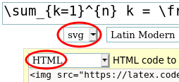
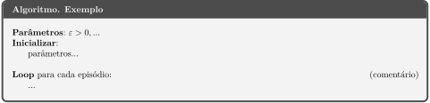

# Ferramentas utilizadas no repositório

## Geração de imagens com LaTeX

### Fórmulas em geral

As fórmulas _inline_ (que ficam na mesma linha que outro texto) devem ser
formatadas, se possível, com unicode e itálico, evitando o uso de imagens.
Por exemplo, o estado de um ambiente é _s_ e não .
O uso de letras gregas, pode ser feito por meio dos escape codes
de HTML: `&epsilon;` para &epsilon;, `&Delta;` para &Delta;, `&delta;` para &delta;, etc.

As fórmulas maiores e, em particular, aquelas que não forem _inline_,
devem ser escritas em LaTeX, utilizando o [editor de equações do CodeCogs](https://www.codecogs.com/latex/eqneditor.php)
em formato SVG, com o código fonte armazenado no título da imagem. Para tanto, basta selecionar as opções "svg" e "HTML"
(não "HTML (Edit)") no CodeCogs, conforme o exemplo abaixo:



```markdown
Equação: $\sum_{k=1}^{n} k = \frac{n(n+1)}{2}$

Markdown (html):

```

Imagem:


### Algoritmos

As caixas de algoritmos devem seguir o template fornecido no arquivo [template_algoritmo.tex](imgs/template_algoritmo.tex).
O código que deve ser modificado está no final do arquivo:

```latex
\title{Nome do Algoritmo}

\begin{document}
\begin{algorithm}
Parâmetros: $\varepsilon > 0, \dots$
Inicializar:
    parâmetros...

Loop para cada episódio: @\hfill@ (comentário)
    ...
\end{algorithm}
\end{document}
```

Dentro do `algorithm`, comandos de latex devem ser executados entre `$$` (modo de matemática) ou
entre `@@` (modo de texto). Por exemplo, os comentários podem ser alinhados ao canto direito da caixa
com o comando `@\hfill@`, conforme o exemplo acima e a imagem abaixo.

Primeiramente, o arquivo deve ser compilado utilizando XeLaTeX. Por exemplo, no terminal, com:

```bash
xelatex -shell-escape algoritmo.tex  # Compila o arquivo latex
```

ou no Overleaf com a opção `Compiler: XeLaTeX`.

Em seguida, é necessário converter o pdf gerado para svg. Recomenda-se o uso da ferramenta Poppler:

```bash
pdftocairo -svg algoritmo.pdf
```



As imagens resultantes, assim como os arquivos fonte em latex devem ser salvos diretório "imgs" do
respectivo algoritmo / grupo de algoritmos.
