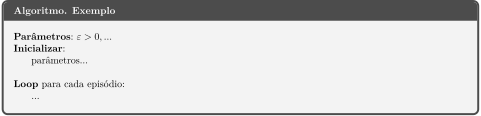

# Ferramentas utilizadas no repositório

## Geração de imagens com LaTeX

### Fórmulas em geral

As fórmulas devem ser escritas em LaTeX, utilizando o [editor de equações do CodeCogs](https://www.codecogs.com/latex/eqneditor.php)
em formato SVG, conforme o exemplo abaixo:

```markdown
Equação: $\sum_{k=1}^{n} k = \frac{n(n+1)}{2}$

Markdown:

```

Imagem:


### Algoritmos

As caixas de algoritmos devem seguir o template fornecido no arquivo [template_algoritmo.tex](template_algoritmo.tex).
O código que deve ser modificado está no final do arquivo:

```latex
\title{Nome do Algoritmo}
\geometry{paperwidth=17cm}

\begin{document}
\begin{algorithm}
Parâmetros: $\varepsilon > 0, \dots$
Inicializar:
    parâmetros...

Loop para cada episódio:
    ...
\end{algorithm}
```

Primeiramente, o arquivo deve ser compilado utilizando XeLaTex. Por exemplo, no terminal, com:

```bash
xelatex -shell-escape algoritmo.tex  # Compila o arquivo latex
```

ou no Overleaf com a opção `Compiler: XeLaTeX.

Em seguida, é necessário converter o pdf gerado para svg. Recomenda-se o uso da ferramenta Poppler:

```bash
pdftocairo -svg algoritmo.pdf
```



As imagens resultantes, assim como os arquivos fonte em latex devem ser salvos diretório "Imagens" do
respectivo algoritmo / grupo de algoritmos.
