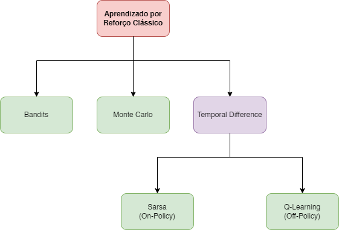
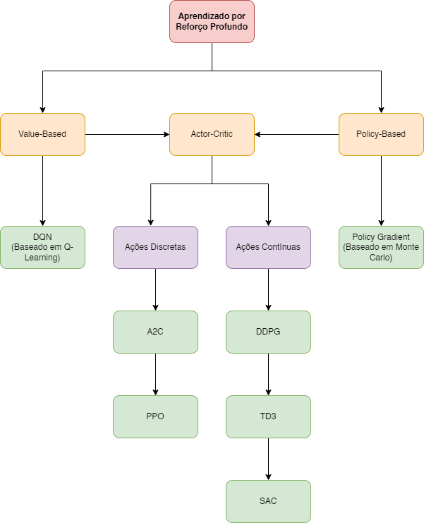

# 🗺️ Guia de Aprendizado

Boas vindas ao **🗺️ Guia de Aprendizado** do Repositório de Aprendizado por Reforço! Aqui, você encontra sugestões de como seguir os tópicos do repositório de modo a organizar melhor seu aprendizado. Ao final do arquivo, também temos recomendações de materiais extra para aprofundar no assunto.

## 💯 Tópicos Introdutórios

- **[Introdução ao Aprendizado por Reforço](../Introdução)**
  - Explica os conceitos básicos da área de Aprendizado por Reforço.
  - Pré-requisitos: Nenhum.
  
## 👨‍🏭 Introduções Práticas

Antes de estudar alguns algoritmos de Aprendizado por Reforço, pode ser interessante se familiarizar com algumas bibliotecas da área de maneira prática, de modo a motivar os estudos.

- **[Gym](../Bibliotecas/Gym)**
  - Aprenda como funciona um ambiente na biblioteca do Gym.
  - Pré-requisitos: [Introdução ao Aprendizado por Reforço](../Introdução).

- **[Stable Baselines](../Bibliotecas/Stable%20Baselines)**
  - Aprenda na prática a programar um agente de Aprendizado por Reforço Profundo.
  - Pré-requisitos: [Gym](../Bibliotecas/Gym).

## 🎰 Aprendizado por Reforço Clássico

Os algoritmos fundamentais do Aprendizado por Reforço se encontram nesta categoria. É importante entender pelo menos alguns para adentrar assuntos mais modernos da área. A seguir, está apresentada uma taxonomia desses algoritmos clássicos:

   
  

- **[Bandits](../Aprendizado%20por%20Reforço%20Clássico/Bandits)**
  - O problema mais clássico da área! Aprender a escolher a melhor ação em uma situação simples.
  - Pré-requisitos: [Introdução ao Aprendizado por Reforço](../Introdução).

- **[Monte Carlo](../Aprendizado%20por%20Reforço%20Clássico/Monte%20Carlo)**
  - Um simples método de Aprendizado por Reforço para resolver problemas com mais estados que os Bandits.
  - Pré-requisitos: [Bandits](../Aprendizado%20por%20Reforço%20Clássico/Bandits).
  
- **[Q-Learning](../Aprendizado%20por%20Reforço%20Clássico/Temporal-Difference/Q-Learning)**
  - Um dos algoritmo mais importantes de Aprendizado por Reforço! Mais aplicável que Monte Carlo e Bandits.
  - Pré-requisitos: [Bandits](../Aprendizado%20por%20Reforço%20Clássico/Bandits).
  
## 🧠 Aprendizado por Reforço Profundo

Por fim, temos os algoritmos de Aprendizado por Reforço Profundo, que se baseiam em redes neurais. Estes são alguns dos mais utilizados em aplicações modernas da área, já que podem representar problemas mais complexos. A seguir, está a apresentada uma taxonomia desses algoritmos:

   
  

- **[Deep Q-Learning](../Aprendizado%20por%20Reforço%20Profundo/Deep%20Q-Learning)**
  - O algoritmo mais popular de Aprendizado por Reforço Profundo. Um aprimoramento de Q-Learning com redes neurais.
  - Pré-requisitos: [Q-Learning](../Aprendizado%20por%20Reforço%20Clássico/Temporal-Difference/Q-Learning).

- **[Policy Gradient](../Aprendizado%20por%20Reforço%20Profundo/Policy%20Gradient)**
  - Um importante algoritmo de Aprendizado por Reforço profundo que aproxima diretamente a política ótima, sem estimar a função de valor.
  - Pré-requisitos: [Monte Carlo](../Aprendizado%20por%20Reforço%20Clássico/Monte%20Carlo).
  
- **[Actor-Critic](../Aprendizado%20por%20Reforço%20Profundo/Actor-Critic)**
  - Algoritmo resultante da poderosa combinação entre Policy Gradient e uma rede neural para estimar a função de valor.
  - Pré-requisitos: [Deep Q-Learning](../Aprendizado%20por%20Reforço%20Clássico/Temporal-Difference/Q-Learning) e [Policy Gradient](../Aprendizado%20por%20Reforço%20Profundo/Policy%20Gradient).

## 📚 Material Extra

A seguir, disponibilizamos também alguns materiais extra para aprofundas em mais conteúdos de Aprendizado por Reforço!

- **[Livro - Sutton & Barto](http://incompleteideas.net/book/RLbook2020.pdf)**: Livro fundamental de Aprendizado por Reforço. Detalha grande parte da teoria da área bem como seus principais algoritmos.
- **[Spinning up - OpenAI](https://spinningup.openai.com/en/latest/)**: Blog da [OpenAI](https://openai.com) com explicação e implementação de vários algoritmos modernos de Aprendizado por Reforço Profundo.
- **[Aprendizado por Reforço - Coursera](https://www.coursera.org/specializations/reinforcement-learning)**: Curso da Universidade de Alberta no Coursera sobre Aprendizado por Reforço. Explica muito dos mesmos conteúdos que o livro de maneira mais visual.
- **[Vídeo Aulas - David Silver](https://www.youtube.com/watch?v=2pWv7GOvuf0&list=PLzuuYNsE1EZAXYR4FJ75jcJseBmo4KQ9-)**: Aulas de Aprendizado por Reforço do professor da University College London e pesquisador da [DeepMind](https://deepmind.com).