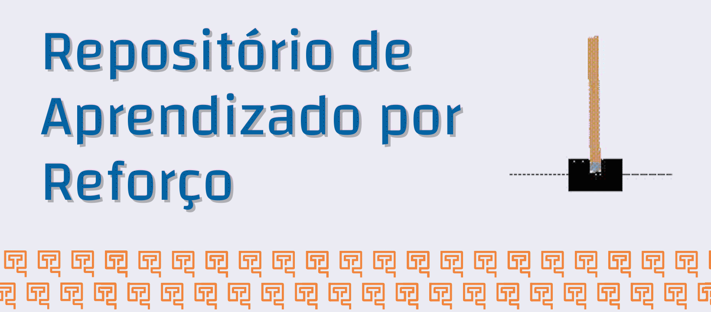

> Repositório de Aprendizado por Reforço desenvolvido pelo Turing USP.

## - [👩‍🏫 Introdução](Introdução)

Introdução ao Aprendizado por Reforço e apresentação de conceitos básicos da área.

## - [🎰 Aprendizado por Reforço Clássico](Aprendizado%20por%20Reforço%20Clássico)

Conceitos importantes de Aprendizado por Reforço como Temporal Difference Learning e implementações de diversos Algoritmos Tabulares.

## - [🧠 Aprendizado por Reforço Profundo](Aprendizado%20por%20Reforço%20Profundo)

Descrição e implementação de algoritmos modernos de Aprendizado por Reforço com redes neurais.

## - [📚 Bibliotecas](Bibliotecas)

Guias e tutoriais de diferentes bibliotecas de Aprendizado por Reforço. Uma boa introdução prática à área.

## ✨ Contribuidores

Agradecimentos a todos esses contribuidores ([emoji key](https://allcontributors.org/docs/en/emoji-key)):

<!-- ALL-CONTRIBUTORS-LIST:START - Do not remove or modify this section -->
<!-- prettier-ignore-start -->
<!-- markdownlint-disable -->
<table>
  <tr>
    <td align="center"><a href="https://github.com/arielguerreiro"> <b>arielguerreiro</b></a> <a href="https://github.com/turing-usp/Aprendizado-por-Reforco/commits?author=arielguerreiro" title="Code">💻</a> <a href="https://github.com/turing-usp/Aprendizado-por-Reforco/commits?author=arielguerreiro" title="Documentation">📖</a></td>
    <td align="center"><a href="https://github.com/Berbardo"> <b>Bernardo Coutinho</b></a> <a href="https://github.com/turing-usp/Aprendizado-por-Reforco/commits?author=Berbardo" title="Code">💻</a> <a href="https://github.com/turing-usp/Aprendizado-por-Reforco/commits?author=Berbardo" title="Documentation">📖</a> <a href="https://github.com/turing-usp/Aprendizado-por-Reforco/pulls?q=is%3Apr+reviewed-by%3ABerbardo" title="Reviewed Pull Requests">👀</a></td>
    <td align="center"><a href="https://github.com/dueiras"> <b>Eduardo Eiras</b></a> <a href="https://github.com/turing-usp/Aprendizado-por-Reforco/commits?author=dueiras" title="Code">💻</a> <a href="https://github.com/turing-usp/Aprendizado-por-Reforco/commits?author=dueiras" title="Documentation">📖</a> <a href="https://github.com/turing-usp/Aprendizado-por-Reforco/pulls?q=is%3Apr+reviewed-by%3Adueiras" title="Reviewed Pull Requests">👀</a></td>
    <td align="center"><a href="https://github.com/fernandokm"> <b>Fernando Matsumoto</b></a> <a href="https://github.com/turing-usp/Aprendizado-por-Reforco/commits?author=fernandokm" title="Code">💻</a> <a href="https://github.com/turing-usp/Aprendizado-por-Reforco/commits?author=fernandokm" title="Documentation">📖</a> <a href="https://github.com/turing-usp/Aprendizado-por-Reforco/pulls?q=is%3Apr+reviewed-by%3Afernandokm" title="Reviewed Pull Requests">👀</a> <a href="#tool-fernandokm" title="Tools">🔧</a></td>
    <td align="center"><a href="https://github.com/luish18"> <b>Luis Henrique de Almeida Fernandes</b></a> <a href="https://github.com/turing-usp/Aprendizado-por-Reforco/commits?author=luish18" title="Code">💻</a> <a href="https://github.com/turing-usp/Aprendizado-por-Reforco/commits?author=luish18" title="Documentation">📖</a></td>
    <td align="center"><a href="https://github.com/nelsonayamashita"> <b>Nelson Alves Yamashita</b></a> <a href="https://github.com/turing-usp/Aprendizado-por-Reforco/commits?author=nelsonayamashita" title="Code">💻</a> <a href="https://github.com/turing-usp/Aprendizado-por-Reforco/commits?author=nelsonayamashita" title="Documentation">📖</a> <a href="https://github.com/turing-usp/Aprendizado-por-Reforco/pulls?q=is%3Apr+reviewed-by%3Anelsonayamashita" title="Reviewed Pull Requests">👀</a></td>
    <td align="center"><a href="https://github.com/FelipeAugustoMachado"> <b>FelipeAugustoMachado</b></a> <a href="https://github.com/turing-usp/Aprendizado-por-Reforco/pulls?q=is%3Apr+reviewed-by%3AFelipeAugustoMachado" title="Reviewed Pull Requests">👀</a></td>
  </tr>
  <tr>
    <td align="center"><a href="https://github.com/rafael-acoelho"> <b>Rafael Araujo Coelho</b></a> <a href="https://github.com/turing-usp/Aprendizado-por-Reforco/pulls?q=is%3Apr+reviewed-by%3Arafael-acoelho" title="Reviewed Pull Requests">👀</a></td>
  </tr>
</table>

<!-- markdownlint-restore -->
<!-- prettier-ignore-end -->

<!-- ALL-CONTRIBUTORS-LIST:END -->

Esse projeto segue a especificação [all-contributors](https://github.com/all-contributors/all-contributors). Qualquer contribuidor é bem vindo!